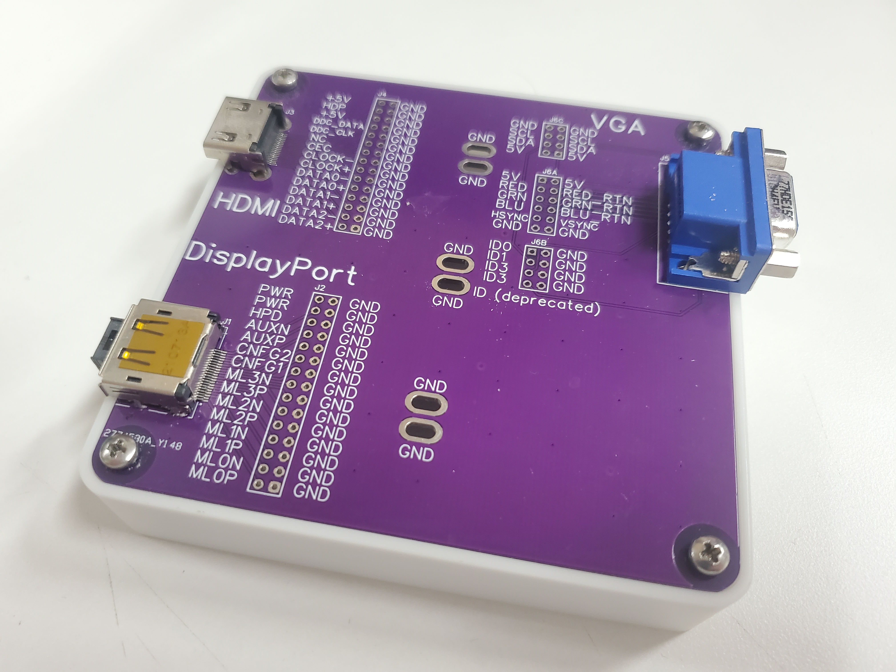

# Generic Board Box

A generic box for holding PCBs with the following charactistics:

* 100 mm x 100 mm size (max size to qualify for JLC PCBs special price)
* 5 mm corner radius
* M3 mounting holes 5 mm from each corner

Note: [PCB.dxf](PCB.dxf) was exported from PCB design software. [PCB.scad](PCB.scad) was used to produce [PCB.stl](PCB.stl), which was then used as a reference in [BoardBox.blend](BoardBox.blend).

Photo of this box with my [video Cable Breakout](https://github.com/PhilboBaggins/video-cable-breakout) sitting on top.
